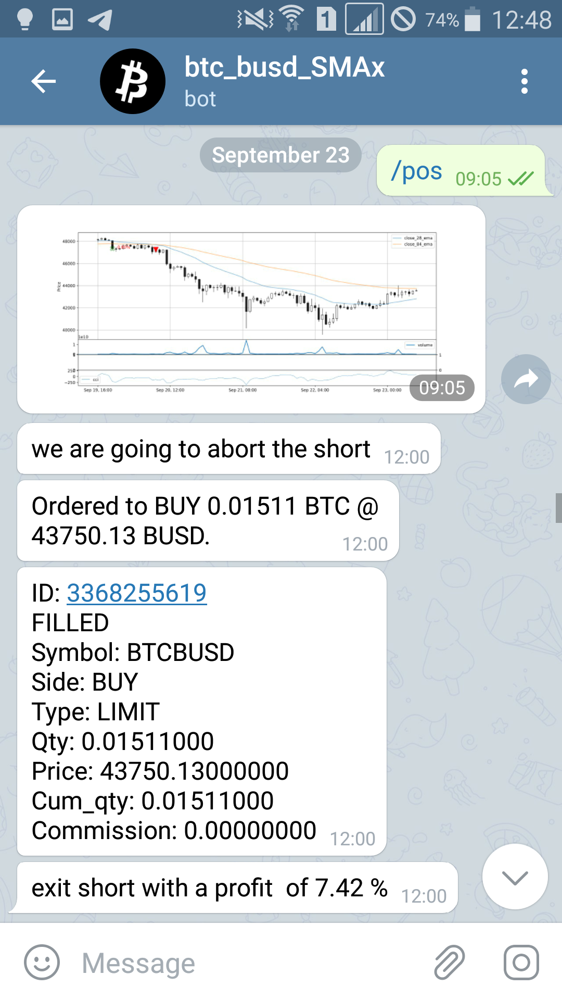

# Cryptocurrency trading bot for Binance


<a href="https://github.com/psf/black"></a>
[](CONTRIBUTING.md)

[](https://travis-ci.org/joemccann/dillinger)

This is an easy-to-use EMA crossing bot for automatic spot trading on [Binance](www.binance.com).

<p float="left">
  
   
</p>

## Getting started

1. Get your API keys on Binance and add them to `loadEnv.sh`.
2. Create a bot on [Telegram](https://telegram.org/). To do that, download the Telegram app, go to [@BotFather](https://telegram.me/BotFather) and copy you bot API token.
3. Adjust the bot parameters in the `BTCBUSD_7_EMAx.ipynb` as necessary:
```
symbol = 'BTCBUSD'
interval = '1h'
slow_ema_period = 21*4 # for 4h candles, change for other intervals
fast_ema_period = 7*4
max_reconnects = 20
telegramApiKey = 'your_telegram_bot_api_key'
```
4. Run `BTCBUSD_7_EMAx.ipynb`

## Features

- Hassle-free trading on Binance
- Performs well in strongly trending markets
- Opens both long and short positions
- Conveniently reports trading performance to your Telegram app
- Reports status, trades, open and closed positions
- Handles dropped connections
- Plots positions and profit/loss at exit
- All the deal info is saved to a dataframe for later analysis
- Uses sockets to get data

<p align="center">
  
</p>

## Telegram commands
- `/pos` - returns a candlestic chart indicating current and past trades and profits
- `/perf` - return trading performance over time (trading vs. buy-and-hold)
- `/pos_ha` - same as `/pos` but plots Heikin-Ashi candlesticks
- `/status` - reports recent stats and internals


## Dependencies

To install dependencies: 
`pip install jupyter==1.0.0 matplotlib==3.4.2 mplfinance==0.12.7a17 mpl-finance==0.10.1 numpy==1.20.3 pandas==1.2.4 python-binance==1.0.12 python-telegram-bot==13.6 requests==2.25.1 stockstats==0.3.2 websocket-client==1.2.0 websocket==0.2.1 yfinance==0.1.59 termcolor==1.1.0`

## Development

Want to contribute? Great!

## License

MIT

**Free Software, Hell Yeah!**
